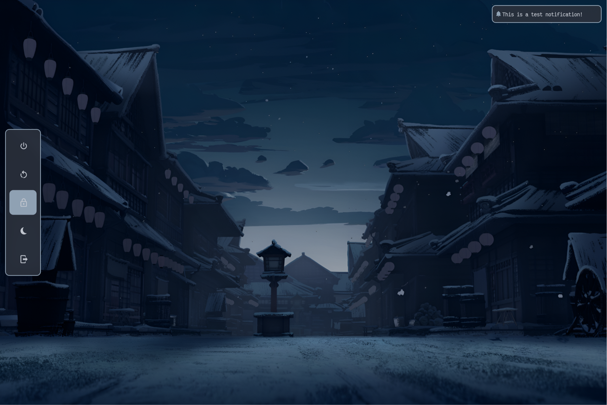
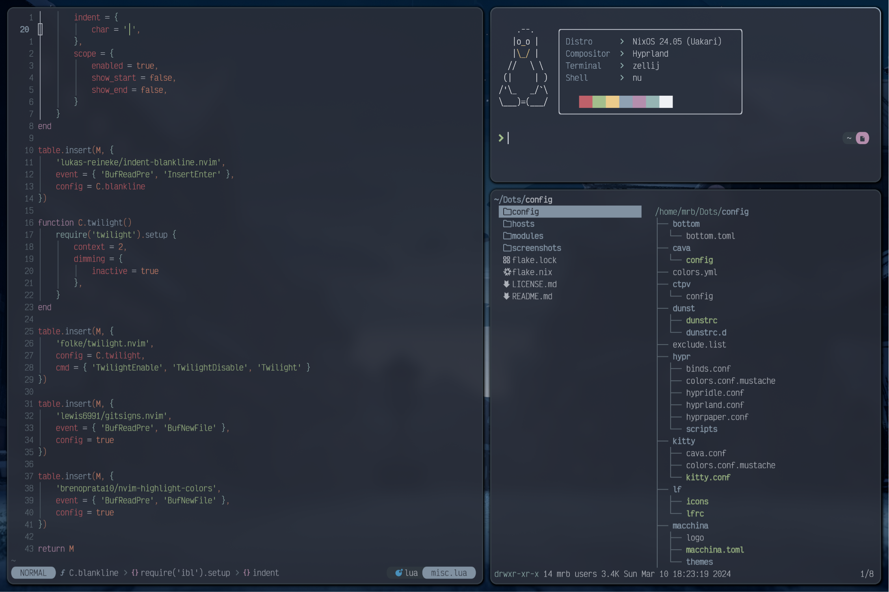
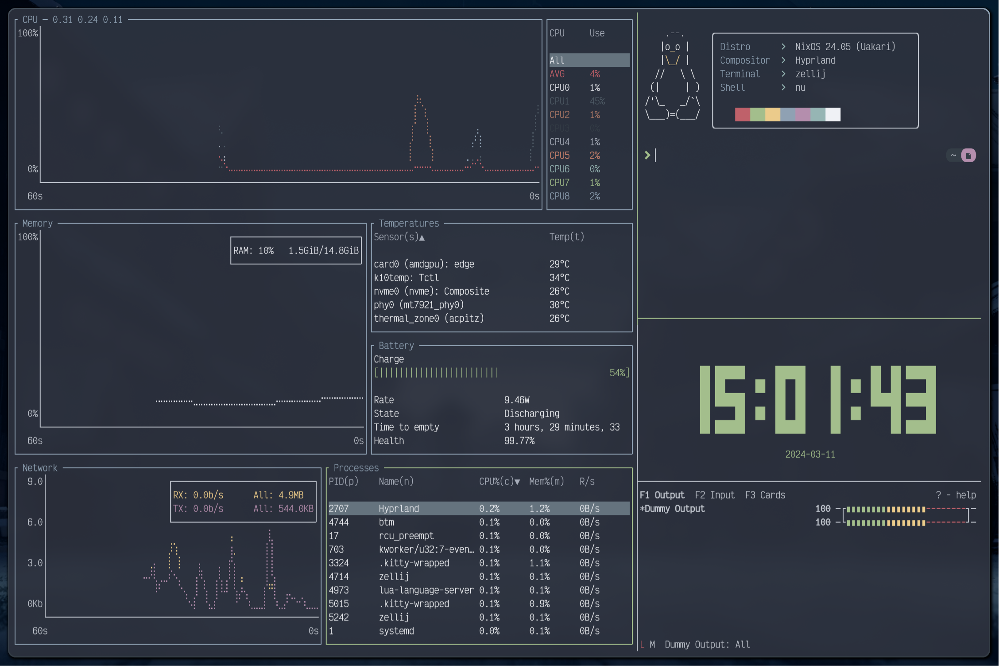

{width=45%}
{width=45%}
{width=45%}
{width=45%}

---

### Structure

* `config/` : Dotfiles for most programs   
* `hosts/` : Nix hardware configs    
* `modules/`        
    * `gui/` : Common configs for desktop use
    * `system/` : Common configs for all systems
    * `misc/` : Specific addons for various systems   
